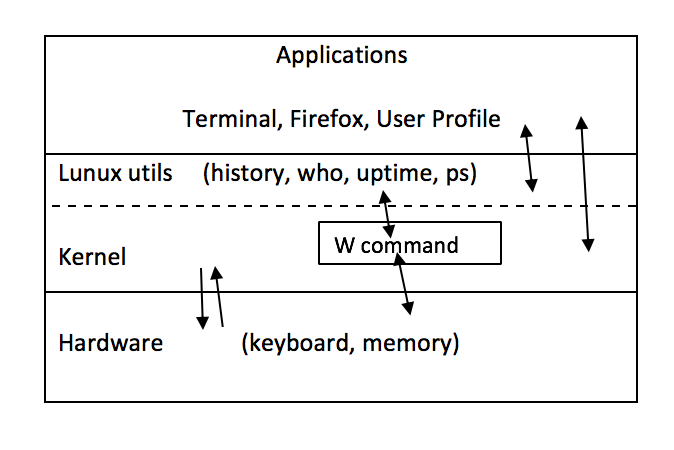

## 2.1 - List of Modules Modified/Affected

We will be modifing the *w* module. The *w* command relies on a few other modules which we may need to modify as well. These modules inclue *history, who, uptime,* and *ps*. The main module modified will be *w.c* though because the bulk of our project will be making sure that the *w* command displays information more clearly than it does now. We are not necessarily changing the information that is displays, but instead are changing how the information is displayed. The module contains print statements which we will modify and reformat. 

## 2.2 - List of New Modules Produced

We will not be producing any new modules for this project.

## 2.3 - Class Diagram of Affected Modules

## 2.4 - Explanation of All Command Line Options Implemented
